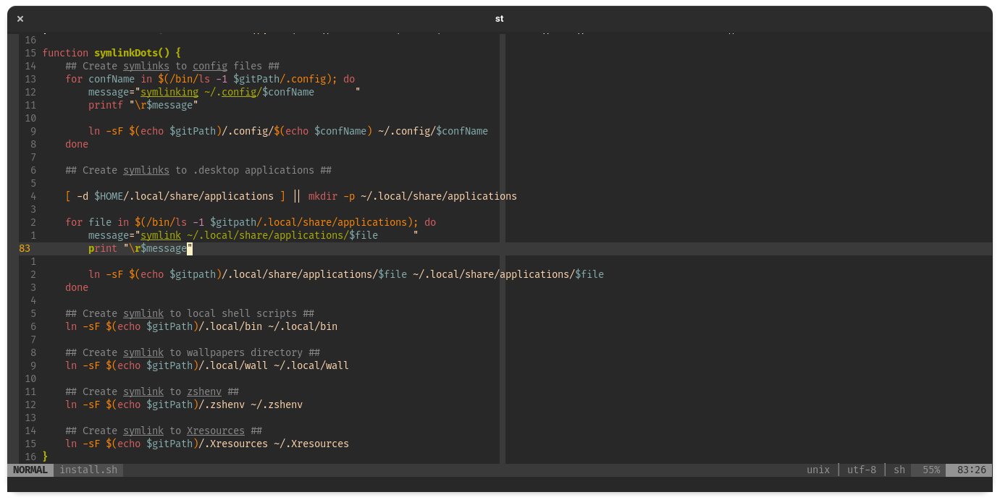

# Saul Dickson's Dotfiles

<div align="center">
<h4>
<a href="#Install">Install</a>&nbsp;&nbsp;&nbsp;&nbsp;&nbsp;&nbsp;
<a href="#Programs">Programs</a>&nbsp;&nbsp;&nbsp;&nbsp;&nbsp;&nbsp;
</h4>
</div>

## Install
Copy and paste this into your terminal:

```
curl https://raw.githubusercontent.com/Saul-Dickson/dotfiles/master/install.sh\
>> install.sh; chmod +x install.sh && ./install.sh
```

This will download the installation file and make it executable. After that,
simply run this command for just the dotfiles.

`./install.sh -D`

## Programs

<div align="center">
<h4>
<a href="#editor-neovim">Editor</a>&nbsp;&nbsp;&nbsp;&nbsp;&nbsp;&nbsp;
<a href="#pager-bat">Pager</a>&nbsp;&nbsp;&nbsp;&nbsp;&nbsp;&nbsp;
<a href="#shell-zsh">Shell</a>&nbsp;&nbsp;&nbsp;&nbsp;&nbsp;&nbsp;
<a href="#file-manager-lf">File Manager</a>&nbsp;&nbsp;&nbsp;&nbsp;&nbsp;&nbsp;
<a href="#browser-firefox">Browser</a>&nbsp;&nbsp;&nbsp;&nbsp;&nbsp;&nbsp;
<a href="#email-client-neomutt">Email Client</a>&nbsp;&nbsp;&nbsp;&nbsp;&nbsp;&nbsp;
<a href="#ebook-reader-epy">Ebook Reader</a>&nbsp;&nbsp;&nbsp;&nbsp;&nbsp;&nbsp;
</h4>
</div>
<hr/>

#### Editor: [neovim](https://github.com/neovim/neovim)



It's quite plugin heavy, but vim is really just a platform for plugin
development. The colorscheme is gruvbox.

#### Shell: [zsh](http://zsh.sourceforge.net)

#### Browser: [firefox](https://www.mozilla.org/en-US/firefox/new/)

#### Email Client: [neomutt](https://github.com/neomutt/neomutt)

#### File Manager: [lf](https://github.com/gokcehan/lf)

#### Pager: [bat](https://github.com/sharkdp/bat)

#### Ebook Reader: [epy](https://github.com/wustho/epy)

#### `find` Alternative: [fd](https://github.com/sharkdp/fd)

#### `ls` Alternative: [exa](https://github.com/ogham/exa)

#### `grep` Alternative: [ripgrep](https://github.com/BurntSushi/ripgrep)

#### `rm` Alternative: [trash-cli](https://github.com/sindresorhus/trash-cli)
